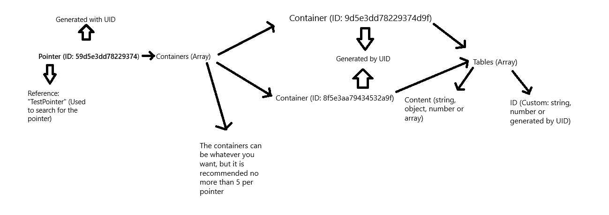

# @OpenDB ~ Best local non-relational database

> Documentation: [OpenDB Docs](https://printfdead.github.io/opendb/index.html)


## Information:
- :wrench: Efficient and fast database using BSON.
- :butterfly: Simple and easy to use
- :smile: Version 1.4
- :globe_with_meridians: More than 10,000 tables per container, using a Buffer of 10240 bytes!

### :wrench: Installation
```sh
npm i @printfdead/open.db --save
yarn add @printfdead/open.db
```

## Why use OpenDB

### :art: Developer experience
> `OpenDB` offers a new, fast and secure experience for storing your data, using a simple structure.
> Given its speed, it allows you to save multiple data, it also allows you to have several databases in use at the same time, such as working with several containers on the same pointer.

### :pushpin: Structure


### :zap: Flexibility & Scalability
> This database is flexible. 
> Although in theory OpenDB is scalable since it can support more than 10 thousand tables per container and save more than 1 thousand tables per second, it can also deserialize a container with more than 10 thousand tables in 100 ms, we do not consider it scalable since As the container becomes larger, it takes longer to save a table, increasing the buffer can balance and solve this problem. 
> Currently OpenDB can be used in any environment, as long as it is required locally.

### :package: Cache
> It saves the data in a `Map` which makes it easier to search and use the database, making it much faster, making the time it takes to execute a method no more than **10ms**

### :clipboard: Important Notes:
> **BSON Error: bson size must be >= 5, is 0** This is solved by deleting the `OpenDB` folder and restarting the app, it is because the containers and pointers were not saved correctly.

> The errors and/or warnings shown in this documentation are errors/warns that can occur when running `OpenDB`, they are only informative, a solution can be reached by reading the description of each error/warn.

> Remember to use awaits, otherwise it may give errors like **BSON Error: bson size must be >= 5, is 0** which happens when saving the empty pointer/container in the file.

### :robot: Project Example:
- [Pinguino](https://github.com/PrintfDead/Pinguino)

### :pencil: Examples:
> `Create Database & Start Client Instance:`
```ts
import { Client, Emitter } from '@printfdead/open.db';

/**
 * @param {object} options - Put database name and path
 * @new Client({ Path?: string, Buffer?: number });
 * @description Instance new Client for create new database or use a database.
 */
const OpenDB = new Client({ Path: "path/to/root/folder", Buffer: 512 });

/** 
 * @param {string} event - Event name
 * @param {function} callback - Callback function
 * @description The event is emitted when the Client class is instantiated.
*/
Emitter.once('start', () => {
  console.log("OpenDB start!");
});

/** 
 * @param {string} event- Event name
 * @param {function} callback - Callback error.
 * @type {error} ErrorClient interface
 * @description The event is emitted on some conditions of the Database class.
*/
Emitter.on('error', (error) => {
  console.error(error);  
});

// Other conditions instantiate the Error clas and stop the database
```
#### Note:
- **Path:** must not start with dot (".", except two dots, EJ: "..") or slashes (/, \) or end in slash
- **Buffer:** custom buffer size, this has to be set depending on how large the bson container is and the amount of bson data you manage in the database, by default it is 512, but you can edit it depending on your needs.
---
> `Start`
```ts
/**
 * @description Create the root folder (database container)
 * @return Promise<this>
 */

await OpenDB.Start();
```
---
> `CreateDatabase`
```ts
/**
 * @param {string} Name - Database name
 * @description Create the database
 * @return Promise<this>
 */

await OpenDB.CreateDatabase("DatabaseName");
```
---
> `SetDatabase`
```ts
/**
 * @param {string} Name - Database name
 * @param {BSON.DeserializeOptions} deserializeOptions (optional) - Deserialize Options
 * @description Select the database
 * @return this
 */

OpenDB.SetDatabase("DatabaseName");
```
---
> `CreatePointer`
```ts
/**
 * @param {String | Number} Reference - A reference to search faster
 * @description Create Pointer
 * @return this
 */

await OpenDB.CreatePointer("PointerReference");
```
---
> `GetPointer`
```ts
/**
 * @param {String | Number} Reference - A reference to search faster
 * @description Get Pointer
 * @return BSON.Document | Undefined
 */
import { Pointer } from '@printfdead/open.db'


OpenDB.GetPointer("PointerReference") as Pointer;
```
---
> `GetContainer`
```ts
/**
 * @param {string} Container - Container ID
 * @param {BSON.DeserializeOptions} deserializeOptions (optional) - Deserialize Options
 * @description Get Container
 * @returns BSON.Document | Undefined
 */
import { Container } from '@printfdead/open.db'

OpenDB.GetContainer("ContainerID") as Container;
```
---
> `Update`
```ts
/**
 * @public
 * @param {BSON.DeserializeOptions} [deserializeOptions=] - Deserialize Options
 * @description Update cache after a change in the container, without the change having been made in the cache.
 * @returns void
 */

OpenDB.Update();
```
---
> `Add`
```ts
/**
 * @param {String | Number | Object | Array} Content - Content push
 * @param {String | Number} Reference - A reference to search faster
 * @param {String | Number} id (optional) - Table ID
 * @param {String} Container (optional) - Container ID
 * @generic {String | Number | Object | Array} T 
 * @description Get Pointer
 * @return Promise<this>
 */

await OpenDB.Add<string>("This content can be object, string, number and array", "Pointer Reference", 1, "Container ID");
```
---
> `AddContainer`
```ts
/**
 * @param {Reference} Reference - Reference to find the pointer easier
 * @param {string} Container (optional) - Container ID
 * @description Add an existing container or not, to a pointer
 * @returns Promise<void>
 */

await OpenDB.AddContainer("Pointer reference", "Container ID");
```
---
> `Find`
```ts
/**
 * @param {(string|number)} Reference - Reference to find the pointer easier
 * @param {PredicateType<T>} predicate - Predicate to find data
 * @param {string} [Container=false] - Container ID
 * @returns {(Table | undefined)}
 */
import { ContainerTable } from '@printfdead/open.db'

const table = OpenDB.Find("Pointer Reference", (value: ContainerTable, index: number) => value.Content === "Hello World!", "Container ID") as ContainerTable;

// Example edit data
table.Content = "Hello World!";
await table.save();

OpenDB.Update();

```
---
> `Filter`
```ts
/**
 * @public
 * @param {(string|number)} Reference - Reference to find the pointer easier
 * @param {PredicateType<T>} predicate - Predicate to filter data
 * @param {string} [Container=false] - Container ID
 * @returns {(ContainerTable[] | undefined)}
 */
import { ContainerTable } from '@printfdead/open.db'

OpenDB.Filter("Pointer Reference", (value: ContainerTable, index: number) => value.Content === "Hello World!", "Container ID") as ContainerTable[];
```
---
> `DeleteTable`
```ts
/**
	* @param {Reference} Reference - Reference to find the pointer easier
	* @param {number} TableId - Table ID
	* @param {string} Container (optional) - Container ID
	* @description Delete Table
	* @returns Promise<void>
  */

await OpenDB.DeleteTable("Pointer Reference", 1, "Container ID");
```
---
> `DeleteTableByKey`
```ts
/** 
 * @param {Reference} Reference - Reference to find the pointer easier
 * @param {string | number | null} KeyName - Key name to search the container
 * @param {Push} KeyValue - Key value to search the container
 * @param {string} Container (optional) - Container ID
 * @description Delete Table by Key
 * @returns Promise<void>
 */

await OpenDB.DeleteTableByKey<string>("Pointer Reference", null, "Test1", "Container ID");
```
#### Note:
- **KeyName:** If your KeyName is not an object just put null.
---
> `DeleteKey`
```ts
/**
 * @param {Reference} Reference - Reference to find the pointer easier
 * @param {number | string | null} KeyName - Key name to search the container
 * @param {Push} KeyValue - Key value to search the container
 * @param {string} Container (optional) - Container ID
 * @description Delete Key
 * @returns Promise<void>
 */

await OpenDB.DeleteKey<string>("Pointer Reference", null, "Test1", "Container ID");
```
#### Note:
- **KeyName:** If your KeyName is not an object just put null.
---
# :exclamation: Important error:
> If you have this error **(ODB-01) The path you specified was not found.** when running your database and you believe that the path is set correctly, start your path only by entering the name of the folder ( Example: "src/").
> This error can be given since the main path for an unknown reason is interpreted as the root of the project, if you want to put the database outside of the src, for example, you can put "src/..", I hope it is useful to solve this problem , we don't know what the root of it is.

### :exclamation: Possible Errors:
- (ODB-01) **The path you specified was not found.** This error is due to the specified path not being found or misplaced.
- (ODB-02) **The database root folder not exists.** This error is due to the root folder (OpenDB/) not being found.
- (ODB-03) **This database does not exist, read https://github.com/PrintfDead/OpenDB#readme to know how to fix this error.** This error is because the database is not created.
- (ODB-04) **If force is not activated, the name of the database cannot be changed.** This is because the database name is already specified, and 'Force' must be set to true to be able to change it.
- (ODB-05) **Pointer not found.** This error is because the pointer not found.
- (ODB-06) **Container not found.** This error is because the container not found.
- (ODB-07) **The id is already in use.** This happens when the table id is already in use.
- (ODB-08) **Key not found.** This happens when the key was not found.
- (ODB-09) **This ID is not correct.** This error is because the container id is not correct.
- (ODB-10) **The database is not configured.** This is because the database is not configured, use the 'SetDatabase()' function to configure the database.
- (ODB-99) **An error occurred and the path was not specified.** This error can occured because the path could not be defined automatically or for other internal reasons.

### :interrobang: Possible Warns:
- (Warn-01) **The root folder already exists, nothing will be created and this function will be skipped.** This warn is because the root folder already exists, it will not affect the code but it will warn that it already exists, so you can delete the 'Start()' function from the code.
- (Warn-02) **The database already exists.** This is because the database already exists, it will not do anything, the function will be skipped.
- (Warn-03) **This can cause loading times to increase significantly.** it is because 'NotLoad' is true
- (Warn-04) **A pointer with this reference already exists, the pointer will not be created.** This is because the pointer with the same reference already exists, it will not give an error, the function will be skipped.

## See more
[](https://discord.gg/ZdMqhEWhUN)
[](https://printfdead.github.io/opendb)
